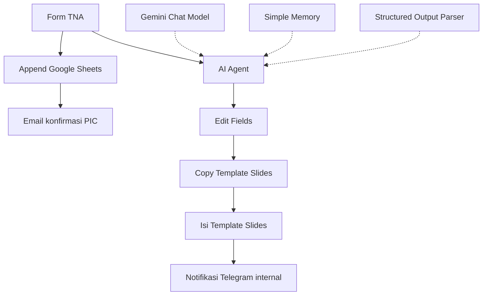

# Otomatisasi TNA dan Draf Proposal Pelatihan Public Speaking

Workflow n8n untuk mengolah **Training Needs Analysis (TNA)** dari calon klien corporate menjadi draf proposal pelatihan Public Speaking. Formulir menjadi sumber analisis AI, pencatatan Google Sheets, email konfirmasi kepada PIC, dan penyusunan presentasi dari template Google Slides untuk direview tim Public Speaking Academy.

| Informasi | Keterangan |
|---|---|
| File workflow | `FINAL_PROJECT_ERRY_SEPTIADI.json` |
| Nama workflow dalam ekspor | `FINAL PROJECT` |
| Jumlah node | 12, termasuk sub-node AI dan Sticky Note |
| Status pada ekspor | Tidak aktif (`active: false`) |
| Sumber dokumentasi | Pemeriksaan konfigurasi dan koneksi pada file JSON |
| Status pengujian | Belum dijalankan langsung dengan akun layanan |

## 1. Latar Belakang

Analisis kebutuhan pelatihan dan pembuatan proposal secara manual memerlukan waktu untuk membaca jawaban calon klien, merumuskan tujuan, memilih modul, dan menyusun bahan presentasi. Proses tersebut dapat memperlambat tindak lanjut tim Training Advisor.

Workflow ini bertujuan membantu tim:

- Mengumpulkan kebutuhan calon klien melalui formulir terstruktur.
- Menyimpan jawaban sebagai rekap TNA.
- Mengirim email konfirmasi penerimaan formulir.
- Menghasilkan rekomendasi program dengan bantuan Gemini.
- Mengisi template presentasi agar draf siap diperiksa manusia.

Penghematan waktu merupakan tujuan proyek. File workflow belum memuat pengukuran durasi, akurasi, atau ROI yang membuktikan besarnya penghematan tersebut.

## 2. Cakupan Otomatisasi

**Input:** formulir TNA yang diisi PIC, HR, atau perwakilan perusahaan.

**Output yang dikonfigurasi:**

1. Baris jawaban formulir pada Google Sheets.
2. Email konfirmasi kepada alamat yang diisi pada formulir.
3. Salinan template Google Slides berisi draf program pelatihan.
4. Notifikasi Telegram kepada tim internal setelah node pengisian Slides berhasil.

Workflow belum mengirim proposal kepada klien, belum mengekspor PDF/PPTX, dan belum menjadwalkan meeting. Review draf, desain akhir, serta tindak lanjut meeting dilakukan oleh tim. Persetujuan manusia dijelaskan dalam prompt, tetapi belum diimplementasikan sebagai node approval.

## 3. Diagram Alur



Form memiliki dua cabang: analisis/pembuatan draf dan pencatatan/email. Cabang tersebut tidak memiliki node Merge atau pemeriksaan keberhasilan gabungan. Percabangan pada diagram tidak menjamin eksekusi serentak; workflow memakai `executionOrder: v1`. Keberhasilan satu cabang tidak membuktikan seluruh workflow selesai, dan error dapat memengaruhi kelanjutan eksekusi.

## 4. Fungsi Setiap Node

| Node | Fungsi dan konfigurasi utama |
|---|---|
| On form submission | Menampilkan formulir TNA dan menerima sembilan field wajib |
| AI Agent | Membaca jawaban TNA, menjalankan instruksi konsultan pelatihan, dan menghasilkan output terstruktur |
| Google Gemini Chat Model | Menyediakan model bahasa untuk AI Agent; nama model tidak ditulis eksplisit pada parameter ekspor |
| Simple Memory | Menggunakan email pengisi formulir sebagai session key |
| Structured Output Parser | Mengatur skema JSON untuk judul, kebutuhan, tujuan, modul, format, outcome, dan catatan internal |
| Edit Fields | Memetakan output AI menjadi field presentasi, termasuk empat modul berdasarkan indeks 0–3 |
| Copy Template Slides | Menyalin presentasi master `Master_Output_TNA` melalui Google Drive |
| Isi Template Slides | Mengganti 11 placeholder pada salinan presentasi |
| Append row in sheet | Menambahkan jawaban formulir ke `TNA_PSAcademy`, tab `Sheet1` |
| Send a message | Mengirim email konfirmasi penerimaan TNA melalui Gmail |
| Send a text message | Mengirim notifikasi internal melalui Telegram ke chat ID tetap |
| Sticky Note | Menjelaskan latar belakang dan alasan otomatisasi; tidak menjalankan proses |

## 5. Data Formulir

Judul formulir: **Training Needs Analysis (TNA) – Public Speaking for Corporate**. Deskripsi form menyebut estimasi waktu pengisian 5–10 menit.

| Label field pada sumber | Wajib | Isi yang diharapkan |
|---|---|---|
| `Nama PIC` | Ya | Nama penanggung jawab perusahaan |
| `Jabatan` | Ya | Jabatan PIC |
| `Nama Perusahaan` | Ya | Nama organisasi calon klien |
| `Email` | Ya | Alamat untuk konfirmasi penerimaan TNA |
| `Tantangan Saat Ini` | Ya | Masalah komunikasi dan situasi terjadinya |
| `Kondisi Saat Ini` | Ya | Kemampuan, kepercayaan diri, dan riwayat training |
| `Ekspetasi` | Ya | Perubahan atau hasil konkret yang diinginkan |
| `Gambaran Calon Peserta` | Ya | Jumlah, jabatan/level, dan rentang usia peserta |
| `Teknis Pelatihan` | Ya | Waktu, durasi, dan preferensi offline/online/hybrid |

**Perhatikan ejaan:** sumber menggunakan `Ekspetasi`. Pertahankan key tersebut jika memakai mapping saat ini. Jika diperbaiki menjadi `Ekspektasi`, ubah seluruh referensi yang terkait, termasuk prompt AI dan mapping Sheets.

Field Email wajib diisi, tetapi tipe input email tidak ditentukan secara eksplisit dalam JSON. Periksa validasinya setelah impor; kewajiban mengisi field tidak otomatis menjamin format alamat benar.

## 6. Kebutuhan Awal

- n8n dengan dukungan node Form Trigger, AI Agent, Gemini, Memory, Output Parser, Google Drive, Google Slides, Google Sheets, Gmail, dan Telegram.
- Credential API Gemini yang dapat digunakan model pilihan.
- Credential Google Drive, Slides, Sheets, dan Gmail dengan akses ke file serta akun yang diperlukan.
- Bot Telegram dan chat tujuan internal yang dapat menerima pesan bot.
- Presentasi master dengan placeholder yang sesuai.
- Spreadsheet rekap dengan header yang sesuai mapping.

Versi aplikasi n8n tidak tercantum dalam file. `typeVersion` merupakan versi node, bukan nomor versi aplikasi n8n.

## 7. Panduan Impor dan Konfigurasi

### 7.1 Impor workflow

1. Impor `FINAL_PROJECT_ERRY_SEPTIADI.json` menggunakan fitur import workflow n8n.
2. Biarkan workflow belum aktif selama konfigurasi dan pengujian.
3. Pilih ulang credentials pada node yang membutuhkan akun eksternal. Referensi credential pada file tidak memindahkan akses akun.
4. Sesuaikan presentasi master, spreadsheet, chat Telegram, dan teks komunikasi.
5. Gunakan data serta penerima uji sebelum mengaktifkan penggunaan sebenarnya.

### 7.2 Konfigurasi AI

Pada `Google Gemini Chat Model`, pilih credential dan periksa model yang tersedia. Ekspor hanya mencantumkan `options: {}` tanpa nama model eksplisit, sehingga dokumentasi ini tidak mengasumsikan model tertentu.

Pastikan tiga koneksi sub-node menuju `AI Agent` tersedia:

- `Google Gemini Chat Model` melalui `ai_languageModel`.
- `Simple Memory` melalui `ai_memory`.
- `Structured Output Parser` melalui `ai_outputParser`.

Aturan analisis dalam system message:

- Menggunakan informasi TNA dan tidak mengarang detail perusahaan, jumlah peserta, atau anggaran.
- Menandai informasi yang belum jelas dengan `[PERLU DIKONFIRMASI TIM PUBLIC SPEAKING ACADEMY]`.
- Menyusun draf untuk review manusia dan tidak mencantumkan harga.
- Menyesuaikan bahasa dan kedalaman materi dengan level peserta.
- Menyusun kebutuhan, tujuan, modul, format/durasi, outcome, dan catatan internal.

Output parser memakai skema berikut:

| Field | Tipe | Wajib |
|---|---|---|
| `judul_training` | String | Ya |
| `sub_judul_training` | String | Ya |
| `ringkasan_kebutuhan` | String | Ya |
| `tujuan_pelatihan` | Array string | Ya |
| `modul_program` | Array object: `nama_modul`, `tujuan`, `metode` | Ya |
| `format_dan_durasi` | Object: `durasi`, `metode`, `rasio_trainer`, `lokasi` | Ya, object-nya |
| `outcome` | Array string | Ya |
| `catatan_internal` | Array string | Ya |
| `estimasi_investasi` | String | Tidak |

Properti anak pada `format_dan_durasi` belum ditandai wajib dalam skema, padahal seluruhnya digunakan pada Edit Fields. Field `estimasi_investasi` masih ada di skema meskipun prompt melarang harga dan field tersebut tidak dipetakan ke Slides.

### 7.3 Periksa Memory

Session key pada sumber:

```javascript
{{ $('On form submission').item.json.Email }}
```

Email yang sama memakai key sesi yang sama sehingga berpotensi membawa konteks pengajuan sebelumnya selama memori tersedia. Untuk analisis setiap formulir secara independen, pertimbangkan menonaktifkan memory atau menggunakan ID pengajuan unik. Jangan menganggap Simple Memory sebagai arsip permanen data TNA.

### 7.4 Siapkan Google Sheets

Pada `Append row in sheet`, pilih spreadsheet dan tab tujuan. Jika mapping sumber dipertahankan, gunakan header persis berikut:

| Header Sheets | Sumber data formulir |
|---|---|
| `Nama PIC` | `Nama PIC` |
| `Jabatan` | `Jabatan` |
| `Nama Perusahaan` | `Nama Perusahaan` |
| `Email` | `Email` |
| `Tantangan Saat ini` | `Tantangan Saat Ini` |
| `Kondisi Saat ini` | `Kondisi Saat Ini` |
| `Ekspedisi` | `Ekspetasi` |
| `Gambaran Calon Klien` | `Gambaran Calon Peserta` |
| `Teknis Pelatihan` | `Teknis Pelatihan` |
| `Tanggal Pengisian` | `submittedAt` |

`Ekspedisi` adalah nama kolom yang tersimpan pada sumber, tetapi isinya adalah ekspektasi pelatihan. Disarankan merapikannya menjadi `Ekspektasi`, serta `Gambaran Calon Klien` menjadi `Gambaran Calon Peserta`, dengan memperbarui header dan mapping bersama-sama.

Operasi yang dipakai adalah `append`. Tidak ada deduplikasi, pembaruan status proposal, penyimpanan URL presentasi, atau penyimpanan hasil AI ke Sheets pada konfigurasi ini. `submittedAt` disimpan langsung tanpa ekspresi konversi zona waktu tambahan.

### 7.5 Siapkan Template Google Slides

Pilih presentasi master pada `Copy Template Slides`. Node membuat nama salinan dengan pola:

```text
Proposal Training [Nama Perusahaan] - [Judul Training]
```

`Isi Template Slides` mengambil ID salinan dari `$json.id`, kemudian mengganti teks placeholder berikut:

| Placeholder literal di template | Field pada Edit Fields |
|---|---|
| `{{JudulTraining}}` | `Judul Training` |
| `{{SubJudulTraining}}` | `Sub Judul Training` |
| `{{NamaPerusahaan}}` | `Nama Perusahaan` |
| `{{RingkasanKebutuhan}}` | `Ringkasan Kebutuhan` |
| `{{TujuanPelatihan}}` | `Tujuan Pelatihan` |
| `{{OutcomePelatihan}}` | `Outcome Pelatihan` |
| `{{ModulSesi1}}` | `Modul Sesi 1` |
| `{{ModulSesi2}}` | `Modul Sesi 2` |
| `{{ModulSesi3}}` | `Modul Sesi 3` |
| `{{ModulSesi4}}` | `Modul Sesi 4` |
| `{{FormatDanDurasi}}` | `Format dan Durasi` |

Tulis placeholder sebagai teks literal, dengan ejaan dan kurung kurawal yang sama. Jumlah slide serta desain master tidak dapat dipastikan dari JSON karena isi template tidak dilampirkan.

Node hanya mengganti teks; tidak ada langkah penyesuaian otomatis ukuran teks atau desain. Tim perlu memeriksa overflow, kepadatan konten, serta keterbacaan presentasi hasil.

Tujuan dan outcome berasal dari array tetapi dipetakan sebagai string. Agar format daftar lebih terkontrol, contoh perbaikan ekspresi yang dapat diterapkan pada Edit Fields adalah:

```javascript
{{ $json.output.tujuan_pelatihan.map((teks, i) => `${i + 1}. ${teks}`).join('\n') }}
```

Ekspresi tersebut merupakan saran penyesuaian, belum diterapkan pada file sumber.

### 7.6 Konfigurasi Gmail

Node `Send a message` menerima data dari node Sheets dan menggunakan:

```javascript
// Penerima
{{ $json.Email }}

// Subjek
Form TNA {{ $json['Nama Perusahaan'] }} Diterima
```

Pastikan output Sheets masih menyediakan `Email`, `Nama PIC`, dan `Nama Perusahaan` yang dibutuhkan email.

Template email mengonfirmasi bahwa TNA diterima, menyebut proses analisis 1–2 jam, dan menjanjikan tindak lanjut meeting oleh tim. Angka 1–2 jam adalah teks komunikasi, bukan jadwal otomatis atau durasi yang dijamin oleh workflow. Sesuaikan dengan kapasitas operasional tim.

### 7.7 Konfigurasi Telegram

Pada `Send a text message`:

1. Pilih credential bot untuk notifikasi internal.
2. Ganti chat ID tetap dengan chat tim yang benar; hapus spasi di akhir nilai sumber.
3. Periksa tautan folder tetap dalam isi pesan dan akses tim ke folder tersebut.
4. Sesuaikan kalimat “seluruh rangkaian program ... selesai dilaksanakan” menjadi “draf proposal selesai dibuat” agar tidak menyiratkan pelatihan sudah berlangsung.

Node penyalinan template tidak menentukan folder tujuan secara eksplisit pada parameter sumber. Karena itu, belum dapat dipastikan salinan berada di folder yang ditautkan dalam Telegram. Tentukan lokasi penyimpanan atau kirim tautan langsung ke salinan presentasi.

Contoh ekspresi tautan langsung yang dapat ditambahkan ke pesan:

```javascript
{{ 'https://docs.google.com/presentation/d/' + $('Copy Template Slides').item.json.id + '/edit' }}
```

Tautan tidak otomatis memberi izin akses; pastikan tim berhak membuka presentasi.

## 8. Cara Penggunaan

1. Setelah konfigurasi dan pengujian selesai, aktifkan/publikasikan workflow sesuai antarmuka n8n yang digunakan.
2. Bagikan URL formulir produksi kepada PIC calon klien.
3. PIC mengisi seluruh field dan mengirim formulir.
4. Workflow menjalankan cabang rekap/email dan cabang pembuatan draf.
5. Tim menerima Telegram setelah proses pengisian Slides berhasil.
6. Tim memeriksa fakta, relevansi modul, kebutuhan konfirmasi, serta tampilan presentasi.
7. Tim menyelesaikan proposal dan menghubungi klien untuk tindak lanjut secara manual.

Jangan menganggap email konfirmasi sebagai bukti proposal telah berhasil dibuat. Sebaliknya, notifikasi Telegram tidak memeriksa apakah email konfirmasi berhasil dikirim.

## 9. Contoh Data Uji

Data berikut fiktif. Untuk menguji email, ganti alamat contoh dengan alamat pengujian yang Anda kelola.

| Field | Contoh |
|---|---|
| Nama PIC | Rina Contoh |
| Jabatan | HR Supervisor |
| Nama Perusahaan | PT. Contoh Nusantara |
| Email | `pic@example.com` |
| Tantangan Saat Ini | Supervisor sulit menyampaikan laporan singkat dan menjawab pertanyaan saat presentasi kepada manajemen. |
| Kondisi Saat Ini | Peserta cukup menguasai materi tetapi kurang percaya diri. Pernah mengikuti pelatihan dasar public speaking. |
| Ekspetasi | Peserta mampu melakukan presentasi terstruktur selama 5 menit dan menjawab pertanyaan secara jelas. |
| Gambaran Calon Peserta | 20 supervisor, usia 28–40 tahun. |
| Teknis Pelatihan | Offline di Jakarta, dua sesi masing-masing tiga jam. Tanggal dan venue belum ditentukan. |

Draf yang diharapkan membahas kebutuhan presentasi supervisor, mempertimbangkan pelatihan dasar sebelumnya, dan menandai tanggal/venue untuk konfirmasi. Materi tidak boleh memasukkan harga atau mengarang profil perusahaan.

## 10. Skenario Pengujian

Semua skenario berikut merupakan rencana uji, **belum hasil pengujian langsung**. Gunakan spreadsheet, template, dan penerima pesan uji.

| ID | Skenario | Kriteria pemeriksaan |
|---|---|---|
| T01 | Form lengkap seperti contoh | Satu baris rekap, email uji, salinan Slides terisi, dan notifikasi internal |
| T02 | Field wajib dikosongkan | Form menolak pengiriman sebelum workflow berjalan |
| T03 | Informasi teknis belum pasti | AI menandai kebutuhan konfirmasi tanpa menebak fakta |
| T04 | Peserta level eksekutif | Gaya proposal ringkas dan strategis sesuai instruksi |
| T05 | AI menghasilkan kurang dari empat modul | Identifikasi kegagalan akses indeks; proses perlu diperbaiki agar aman |
| T06 | AI menghasilkan lebih dari empat modul | Catat modul setelah indeks 3 yang tidak dipetakan ke template |
| T07 | Email sama untuk dua kebutuhan berbeda | Pastikan hasil pengajuan baru tidak tercampur konteks memory sebelumnya |
| T08 | Placeholder hilang atau salah ejaan | Temukan bagian yang tidak terisi pada pemeriksaan visual |
| T09 | Konten jawaban panjang | Periksa teks meluap dan keterbacaan Slides |
| T10 | Akses Drive/Sheets/Gmail/Telegram gagal | Catat node yang gagal dan hasil parsial yang sudah terbentuk |
| T11 | Form yang sama dikirim ulang | Identifikasi baris, salinan presentasi, dan pesan duplikat |
| T12 | Output memuat catatan internal | Pastikan tidak muncul dalam materi klien; periksa mekanisme review internal |

Catat ID eksekusi, input, hasil aktual, status lulus/gagal, serta bukti email, rekap, dan presentasi untuk setiap pengujian. Ukur waktu dari submit hingga draf siap untuk menilai manfaat otomatisasi.

## 11. Temuan Penting dan Saran Perbaikan

Saran berikut berasal dari pemeriksaan file dan belum diterapkan pada workflow sumber.

| Temuan | Dampak | Saran |
|---|---|---|
| Edit Fields mengakses empat indeks modul, tetapi schema tidak membatasi jumlah modul | Kurang dari empat dapat gagal; lebih dari empat tidak seluruhnya masuk Slides | Selaraskan kebutuhan template dan schema, atau buat pemetaan modul dinamis |
| Prompt meminta heading teks, sementara parser meminta object JSON | Instruksi format berpotensi tidak selaras | Minta AI mengisi properti JSON; gunakan heading pada template presentasi |
| Properti format/durasi tidak diwajibkan satu per satu | Field presentasi dapat kosong atau undefined | Wajibkan properti yang digunakan dan tetapkan penanda konfirmasi |
| Schema masih memiliki estimasi investasi | Tidak sesuai larangan harga pada prompt | Hapus field jika memang tidak digunakan |
| Memory memakai email sebagai key | Konteks pengajuan berbeda dapat bercampur | Gunakan ID submission atau hapus memory untuk analisis independen |
| Catatan internal hanya ada pada output/Edit Fields | Tidak tersimpan ke Slides, Sheets, atau pesan internal | Simpan pada tujuan internal terpisah untuk review; jangan masukkan ke proposal klien |
| Tautan Telegram adalah folder tetap | Tim tidak langsung memperoleh tautan draf baru | Tambahkan URL salinan presentasi dan nama perusahaan |
| Tidak ada pemeriksaan status gabungan dua cabang | Hasil parsial dapat terlihat seperti proses selesai | Rekam status rekap, email, pembuatan draf, dan notifikasi secara terpisah |
| Tidak ada deduplikasi, approval node, atau penanganan error khusus | Pengulangan dan kegagalan membutuhkan pemeriksaan manual | Tambahkan ID pengajuan, status proses, jalur error, dan review sesuai kebutuhan |
| Input form menjadi konteks AI | Jawaban bisa berisi instruksi yang tidak relevan | Tegaskan bahwa jawaban adalah data TNA dan tidak boleh mengubah aturan sistem |

## 12. Troubleshooting

| Kendala | Pemeriksaan yang dilakukan |
|---|---|
| AI Agent gagal berjalan | Credential/model Gemini, ketersediaan kuota, koneksi sub-node, dan detail error eksekusi |
| Parser menolak output | Kesesuaian tipe data, field wajib, dan instruksi format prompt |
| Error pada Modul Sesi 3/4 | Jumlah elemen `output.modul_program` dan akses indeks pada Edit Fields |
| Placeholder tidak berubah | Ejaan placeholder, presentasi yang dipilih, dan ID salinan dari node Copy |
| Tujuan/outcome tampil sebagai teks array | Format string pada Edit Fields; gunakan pemetaan daftar yang eksplisit |
| Proposal tidak ditemukan pada folder notifikasi | Lokasi aktual salinan Drive; folder tujuan belum diatur eksplisit |
| Gmail tidak terkirim | Alamat Email dari output Sheets, credential, dan status node Gmail |
| Telegram tidak masuk | Credential bot, chat ID termasuk spasi tambahan, dan akses bot ke chat |
| Data Sheets ada tetapi draf belum jadi | Periksa cabang AI/Slides; kedua cabang tidak memiliki status keberhasilan gabungan |
| Isi pengajuan lama muncul kembali | Session key Simple Memory dan penggunaan email yang sama |

## 13. Checklist Sebelum Digunakan

- [ ] Seluruh credentials sudah terhubung ke akun yang tepat.
- [ ] Model Gemini telah dipilih dan diuji.
- [ ] Label form dan header Sheets selaras dengan mapping.
- [ ] Template memuat seluruh 11 placeholder dan dapat disalin.
- [ ] Jumlah modul dan schema output sudah diselaraskan.
- [ ] Format teks serta properti format/durasi sudah diverifikasi.
- [ ] Chat ID dan tautan Telegram mengarah ke tujuan internal yang benar.
- [ ] Janji waktu tindak lanjut email sesuai kemampuan tim.
- [ ] Catatan internal memiliki tempat review yang terpisah dari materi klien.
- [ ] Seluruh skenario uji relevan sudah dijalankan dengan data uji.
- [ ] Tim mengetahui cara menangani hasil parsial dan eksekusi ulang.
- [ ] Workflow diaktifkan dan URL produksi diperiksa sebelum dibagikan.

## 14. Catatan Data dan Publikasi

Form mengumpulkan identitas PIC, email, dan kebutuhan perusahaan; jawaban diteruskan ke model AI serta layanan Google sesuai konfigurasi. Batasi akses rekap, presentasi, dan riwayat eksekusi kepada tim yang membutuhkan.

Sebelum membagikan JSON ke repository, periksa referensi credential, ID dokumen, chat ID, tautan folder, dan data eksekusi yang mungkin ikut diekspor. README ini tidak menyalin ID sumber tersebut.

Dokumentasi disusun dari `FINAL_PROJECT_ERRY_SEPTIADI.json`. File workflow asli tidak diubah. Isi dan desain presentasi master serta hasil eksekusi layanan belum diperiksa langsung.
